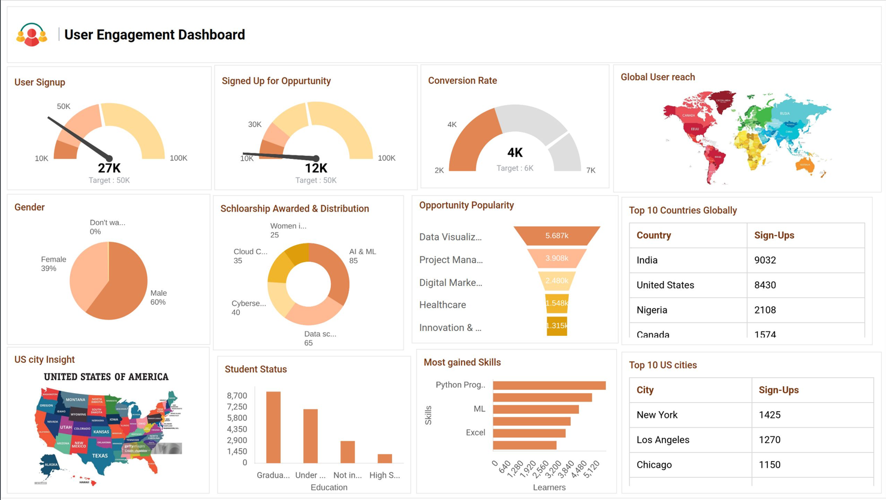

# 🚀 Excelerate User Engagement Dashboard
### *Transforming Data into Actionable Insights*

---

## 👥 Meet the Team

| Role | Team Member |
| :--- | :--- |
| **Team Lead** | Abhay Sahu |
| **Members** | Abdullah Zafar, Alimot Ola, Kalyani Kondepu |

---

## 📋 Overview

The **Excelerate User Engagement Dashboard** transforms complex user and opportunity datasets into actionable insights. Built to support strategic decision-making for platform leadership, the dashboard visualizes key performance indicators (KPIs) including total sign-ups, opportunity participation rates, global reach, top-performing skills, and scholarship distributions.

---

## ✨ Key Features & Dashboard Components

* **Platform Activity Overview**: High-level metrics tracking total user sign-ups (27.4K) and opportunity sign-ups (20.3K).
* **Global & Regional Reach**: Interactive world map and data tables highlighting top-performing countries (led by India, the United States, and Nigeria) and key U.S. city hubs (such as Saint Louis and Chicago).
* **Opportunity Popularity & Funnel Analysis**: Funnel visualization showcasing engagement drop-offs and popularity across categories like *Data Visualization* and *Project Management*.
* **Demographics & Student Status**: Interactive breakdown of user gender distribution and academic statuses (ranging from graduate students to high schoolers and those not in education).
* **Scholarship Distribution**: Visual representation tracking total scholarship funding awarded and distributed across different opportunity categories.
* **Skills Development Trends**: Insights into the most acquired skills on the platform, reinforcing high-demand tracks like Computer Science, Information Systems, and Data Science.
* **Dynamic Filtering**: Real-time filtering options allowing users to drill down by date range, country, state, and user status.

---

## 🖼️ Dashboard Wireframe

Below is the initial wireframe layout conceptualized for the dashboard design:

---

## 🛠️ Tech Stack & Tools

* **Data Processing & Cleaning**: Python (`Pandas`, `NumPy`) for handling missing values, standardizing formats, and merging datasets.
* **Visualization & Dashboarding**: Google Data Studio / Looker Studio for real-time interactive dashboards and custom wireframing.
* **Data Sources**:
  * `UserData.csv` / `NewUserData.csv`: User profiles, sign-up dates, geography, and demographics.
  * `Opportunity Wise Data.csv` / `NewOpportunityDataset.csv`: Opportunity tracking, status descriptions, rewards, and skills earned.

---

## 📊 Summary of Key Insights

* **Engagement & Conversion**: While overall platform sign-ups are strong (~27.4K), opportunity participation requires targeted retention campaigns to drive higher conversion from casual visitors to active participants.
* **Geographic Concentration**: The United States and India form the primary user bases, with secondary hubs rapidly expanding across Nigeria, Pakistan, and Ghana.
* **Top Programs**: Data-centric opportunities (such as Data Visualization, Project Management, and AI/ML pathways) drive the vast majority of user completions and scholarship allocations.
* **User Profiles**: The user base is predominantly composed of Graduate Program and Undergraduate students, with strong representation from engineering and technology majors.

---

## 🚀 Getting Started

To explore or deploy this dashboard locally:
1. Review the data preprocessing steps and script workflows found in the provided analysis reports (`Data Analysis.pdf` and `EDA report.PDF`).
2. Load the cleaned datasets (`NewUserData.csv` and `NewOpportunityDataset.csv`) into your preferred business intelligence tool (such as Google Looker Studio or Power BI).
3. Apply the wireframe layout guidelines outlined in `Dashboard Wireframe.jpg` to replicate the modular reporting grid.

---

  <em>Designed and Developed by Team 33 for Excelerate Platform Analytics</em>

